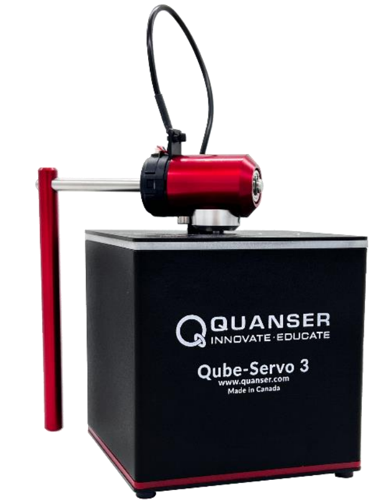
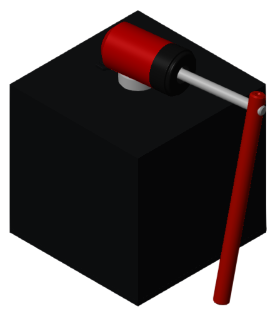
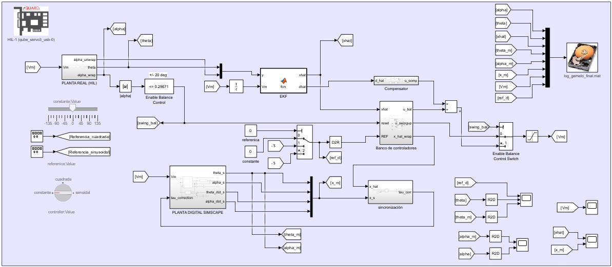

<h1 align="center">Gemelo digital del péndulo invertido de Furuta</h1>
<h3 align="center">Quanser QUBE-Servo 3 · modelo analítico · EKF · control · tiempo real</h3>

<p align="center">
  
  &nbsp;&nbsp;&nbsp;
  
</p>
<p align="center"><em>Izquierda: el equipo real (planta M0). Derecha: el modelo 3D en Simscape Multibody (M2).</em></p>

<p align="center">
  
  
  
  
</p>

---

Este repositorio reúne el código, los datos, los modelos y las figuras del trabajo de
titulación *«Evaluación del impacto de la simulación en tiempo real en la fidelidad de un
gemelo digital aplicado al péndulo invertido QUBE-Servo 3»* (Universidad de Cuenca,
Facultad de Ingeniería, 2026).

El objetivo es construir un **gemelo digital** del péndulo de Furuta del equipo Quanser
QUBE-Servo 3, validarlo contra el equipo real y estudiar cómo influye la **simulación en
tiempo real** en su fidelidad, sincronización y desempeño.

## Idea en una figura

El trabajo maneja tres representaciones de la misma planta y las hace convivir:

| | Descripción |
|---|---|
| **M0 — real** | El equipo físico QUBE-Servo 3 (foto de la izquierda), leído por QUARC. |
| **M2 — 3D** | Modelo de alta fidelidad SolidWorks → Simscape Multibody (imagen de la derecha). |
| **M1 — analítico** | Modelo por Euler-Lagrange, `f(x,u)` y jacobianos en forma cerrada; es el gemelo que se despliega. |

Sobre M1 se cierra el lazo con un **observador (filtro de Kalman extendido, EKF, de estado
aumentado)** que estima el estado y la perturbación del cable a partir de los encoders, y
un **banco de control** (swing-up por energía + balance LQI/LQR/PD/PID). El mismo M1 se
ejecuta sin cambios sobre cuatro sustratos (SIM, QSM, QHW, RTB) para medir el efecto de la
simulación en tiempo real.

## Modelo principal: `DT_bidireccional_RT`

El modelo integrador de todo el trabajo es **`modelos/gemelo/DT_bidireccional_RT.slx`**. Es
el gemelo digital bidireccional: acopla la planta real (por HIL/QUARC) con la planta digital
(Simscape 3D), comparte el observador EKF y el banco de control, y sincroniza ambos lados.

<p align="center">
  
</p>

De un vistazo, en la captura: el bloque **PLANTA REAL (HIL)** (lectura de θ, α por QUARC), el
**EKF** que entrega `x̂` y la perturbación estimada `d̂`, el **banco de controladores** con la
conmutación swing-up → balance (`|α| ≤ 0.297 rad`), la **PLANTA DIGITAL SIMSCAPE** (el espejo
3D), el bloque de **sincronización** entre ambos, y el registro a `log_gemelo_final.mat`.

> Nota: `DT_bidireccional_RT` compila y corre; los ensayos de seguimiento en tiempo real
> cargan referencias grabadas por corrida (`ref_u`, `ref_xhat`) y la ganancia de sincronía
> `Ksync_tau`, propios de cada experimento.

Otros modelos de interés:

| Modelo | Rol |
|---|---|
| `modelos/gemelo/DT_bidireccional_RT.slx` | **Gemelo bidireccional (principal).** |
| `modelos/gemelo/Comparacion_real_modelo3d.slx` | Real y 3D en paralelo, sin sincronización (verificación de construcción). |
| `modelos/ekf_control/Digital_twin_ekf_E1…E5.slx` | Construcción incremental del EKF + control (etapas E1–E5). |
| `modelos/modelo_3d/Ensamblaje_..._v4.slx`, `Model3d_Furuta_Pendulum.slx` | Modelo 3D (SolidWorks → Simscape), base de la calibración. |
| `RTS_modalidades/` | El mismo M1 en las 4 modalidades de ejecución (SIM/QSM/QHW/RTB). |

## Estructura del repositorio

```
TESIS_FINALES/
├── codigo/            Scripts y funciones de MATLAB, por etapa
│   ├── parametros_furuta.m        Parámetros físicos finales (cargar primero)
│   ├── referencia/                Parámetros de referencia de Quanser
│   ├── identificacion/            Identificación por ensayo aislado (§4.3)
│   ├── validacion/                Validación de fricción y retorno del cable
│   ├── modelo_control/            Modelo analítico M1, EKF y control (§4.4–§4.6)
│   └── gemelo/                    Real vs. 3D y gemelo bidireccional (§4.8)
├── datos/             Datos de entrada y registros (.mat/.csv), por tema
├── figuras/           Figuras del Desarrollo y del Anexo, por tema
├── modelos/           Modelos de Simulink/Simscape (.slx), por tema
├── RTS_modalidades/   Las 4 modalidades (SIM/QSM/QHW/RTB) y su comparación
├── assets/            Imágenes de esta portada
├── setup_paths.m      Prepara el path y carga los parámetros
├── repo_root.m        Devuelve la raíz del repositorio
├── INDICE_documentacion.md   Índice unificado de la documentación
├── LICENSE            Licencia MIT
└── CITATION.cff       Cómo citar
```

Cada carpeta de nivel superior incluye su propio `README.md` con el detalle de su contenido.

## Requisitos

- MATLAB (probado en R2025a; compatible desde R2019a, versión de la `quarc_library` usada).
- Simulink, Simscape y Simscape Multibody.
- Symbolic Math Toolbox (derivación del modelo y de las funciones del EKF).
- Control System Toolbox (LQR/LQI) y Simulink Control Design (linealización del 3D).
- Statistics and Machine Learning Toolbox (algunos estimadores de la identificación).
- QUARC (Quanser) para las corridas en tiempo real y contra el hardware; no es necesario
  para la simulación offline ni para los scripts de post-proceso.

## Uso rápido

```matlab
% 1) Desde la raíz del repositorio, preparar el path y cargar los parámetros:
setup_paths        % añade codigo/ datos/ modelos/ RTS_modalidades/ al path
                   % y deja el struct 'p' en el workspace (parametros_furuta.m)

% 2) Abrir cualquier modelo desde su subcarpeta: su PreLoadFcn localiza la raíz,
%    arma el path y carga los parámetros automáticamente. Por ejemplo:
open_system('DT_bidireccional_RT')      % el modelo principal
open_system('Digital_twin_ekf_E1')      % una etapa del EKF

% 3) Correr los scripts de identificación / validación / comparación, p. ej.:
calc_friction               % identificación de la fricción del motor
comparar_analitico_simscape % modelo analítico M1 vs. modelo 3D M2
```

Los scripts resuelven sus datos por el path; no usan rutas absolutas. Los scripts de
post-proceso de las modalidades están en `RTS_modalidades/scripts/`.

## Parámetros físicos (valores finales adoptados)

| Grupo | Parámetro | Valor |
|---|---|---|
| Péndulo (α) | masa `mp`, longitud `Lp` | 0.024 kg, 0.12865 m |
| | Coulomb `Tc_alpha` | 6.1×10⁻⁶ N·m |
| Brazo (θ) | inercia `Jr` (eje motor) | 1.38×10⁻⁴ kg·m² |
| | viscoso `Dr` | 3.975×10⁻⁴ N·m·s/rad |
| Cable del encoder | rigidez `kc` | 2.384×10⁻³ N·m/rad |
| Motor DC | `Rm`, `kt = km` | 7.5 Ω, 0.0422 |
| Muestreo | `Ts` | 0.002 s (500 Hz) |
| Gravedad local | `g` | 9.7807 m/s² |

## Resultados principales

- El modelo analítico M1 reproduce al modelo 3D M2 con RMSE θ = 0.64°, α = 0.83°; polo
  inestable en +13.42 rad/s.
- EKF de estado aumentado sobre el equipo real: RMSE θ, α ≈ 0.03°.
- El sustrato de ejecución no cambia la fidelidad (RTB ≈ QSM ≈ SIM, mismo M1, todas dentro
  de la brecha M1↔M0); el delta entre modalidades mide la simulación en tiempo real (jitter,
  overruns, integrador). Detalle en `RTS_modalidades/`.

## Documentación

El punto de entrada único a toda la documentación es
[`INDICE_documentacion.md`](INDICE_documentacion.md). El estado global del trabajo está en
[`ESTADO_FINAL_PROYECTO.md`](ESTADO_FINAL_PROYECTO.md).

## Licencia y cómo citar

Código, datos y modelos se publican bajo licencia **MIT** (ver [`LICENSE`](LICENSE)). Si
utiliza este repositorio, por favor cite la tesis asociada (ver
[`CITATION.cff`](CITATION.cff)):

> Bermeo García, P. A.; Guazhima Fernández, S. S. (2026). *Evaluación del impacto de la
> simulación en tiempo real en la fidelidad de un gemelo digital aplicado al péndulo
> invertido QUBE-Servo 3*. Trabajo de titulación, Universidad de Cuenca, Facultad de
> Ingeniería.

## Autores

**Pablo Andrés Bermeo García** · **Sebastián Stalin Guazhima Fernández**
Universidad de Cuenca — Facultad de Ingeniería
